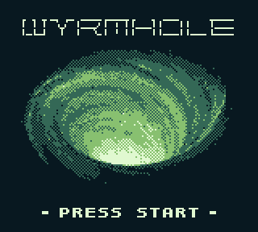
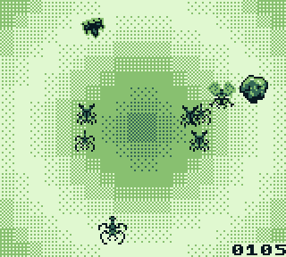
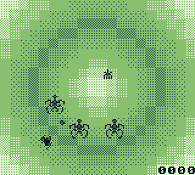

# Wyrmhole
  
A fast-paced circular space shooter for the Game Boy!  
Originally created in 7 days for [Game Boy Showdown 2022](https://itch.io/jam/game-boy-showdown).  
Written in a mixture of C and ASM using [GBSDK](https://github.com/daid/gbsdk).  
Music and SFX by [Coffee Bat](https://coffeebat.neocities.org/)  
Play it online [here](https://quinnp.itch.io/wyrmhole)!

## Screenshots

## Building
First, follow the [GBSDK install instructions](https://daid.github.io/gbsdk/setup/installation.html). This project expects RGBDS 0.5.2 and SDCC 4.2.0.  
After that, you can just run `make` in the base directory. The ROM is generated as `Wyrmhole.gb`.

## Assets Used
- [WitchFont8](https://lavenfurr.itch.io/witchfont8) by Lavenfurr
- [Old School Shooter Set](https://opengameart.org/content/16x16-old-school-shooter-set) by Mumu
- [Wormhole Image](https://pixabay.com/illustrations/wormhole-black-hole-galaxy-5319067/) by AlexAntropov86, converted using [GB Pic](http://yrlab.zatunen.com/webgl/gbpic/gbpic.html)
- [hUGEDriver](https://github.com/SuperDisk/hUGEDriver) by SuperDisk
- [CBT-FX](https://github.com/datguywitha3ds/CBT-FX) by Coffee Bat
